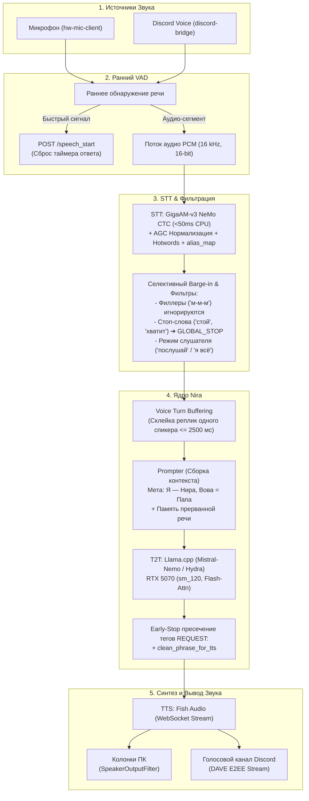

# Шапка с целями проекта (не удалять)

Я разрабатываю локального AI vTuber  
Данная папка - это проект с гитхаба взятый как основа архитектуры. Заявлено, что у проекта асинхронный пайплайн и модульное подключение всех инструментов и систем
======================================
Идея моего проекта:
1. Устойчивый характер.
2. Осознанание себя в моменте.
3. Развитие личности
4. Продвинутая эмоциональность
5. Развитая система долгосрочной, контекстной и рефлексивной памяти
6. Развитие смекалки, логики, пространственного мышления
7. Улучшение социальных навыков
8. Умение общаться с несколькими людьми или на стримах со мной и чатом
9. Дообучение на своих же диалогах
10. Идентификация по голосу
11. Интеграция с Discord и играми
=======================================
Спеки ПК для проекта:
R7 5700 X3D
DDR 4 3600 mHz 32 GB
RTX 5070 12 GB
SSD M2 Samsung 980 PRO 1 TB
Windows 11
=======================================

# Архитектура проекта "Нира" (Исчерпывающая техническая спецификация)

Данный документ представляет собой фундаментальное и исчерпывающее техническое руководство по всей кодовой базе проекта Nira. В нем детально каталогизированы все программные модули, классы, их публичные и внутренние методы, форматы передаваемых данных, асинхронные пайплайны, механизмы защиты очередей, алгоритмы раннего прерывания (barge-in) и аппаратные оптимизации.

Документ составлен таким образом, чтобы любой сторонний разработчик или AI-агент мог получить 100% представление о принципах работы всей системы без необходимости реверс-инжиниринга исходного кода.

---

## 1. Архитектурная Концепция и Сквозной Data Flow

Nira — это событийно-ориентированный асинхронный backend локального AI vTuber с эффектом осознанности, естественной разговорной речью, динамическим темпом и устойчивым характером.

### 1.1. Сквозная схема потока данных (End-to-End Pipeline)



```
[ Микрофон (hw-mic-client) / Discord Voice (discord-bridge) ]
                           │
                 [ Обнаружение речи ]
                           │
       ┌───────────────────┴───────────────────┐
       ▼                                       ▼
[ Ранний VAD-сигнал ]                 [ Аудиопоток (PCM) ]
(POST /speech_start)                  (16 kHz, 16-bit mono)
(Сброс таймера ответа)                          │
(Предотвращение перебивания)                    ▼
                                      [ STT: GigaAM-v3 NeMo CTC ]
                                      (sherpa-onnx, <50ms CPU)
                                      (AGC нормализация, hotwords)
                                      (Словарь омофонов alias_map)
                                               │
                                               ▼
                              [ Селективный Barge-in & Фильтры ]
                              - Фильтр филлеров: "м-м-м", "эээ" НЕ сбивают Ниру
                              - Стоп-слова: "стой", "хватит" ➔ мгновенный stop_audio
                              - Осмысленная речь: вопрос/обращение ➔ прерывание речи
                              - Хук suppress_interruptions: иммунитет к сбиванию
                              - Режим слушателя: триггеры "послушай" / "я всё"
                                               │
                                               ▼
                               [ Voice Turn Buffering (nira.py) ]
                               - Расчёт audio_gap_ms (start - prev_end)
                               - Расчёт wall_gap_ms (time - last_stt)
                               - Склейка фраз одного спикера (<=2500 ms)
                               - Дебаунс тишины: 750 ms (вопрос) / 1400 ms (рассказ)
                                               │
                                               ▼
                                 [ Prompter: Сборка контекста ]
                              - Фильтрация <!-- комментариев -->
                              - Мета-инструкции: "Я — Нира" & (Вова == Папа == Создатель)
                              - Личность и бэкграунд (character.md)
                              - Физическая сцена (scene_local.md / scene_discord.md)
                              - Окружение Discord (динамический список участников)
                              - Память прерванной речи (Interrupted Speech Memory)
                              - История диалога (ChatMessage с санитайзингом)
                                               │
                                               ▼
                                   [ T2T: LlamaCpp / Groq ]
                                 (Mistral-Nemo / Hydra, RTX 5070)
                                 (FlashAttention, sm_120, ctx 8192)
                                               │
                                  [ Стриминг токенов + Early-Stop ]
                                 (Пресечение тегов REQUEST:)
                                               │
                                               ▼
                                  [ Санитайзер clean_phrase_for_tts ]
                                 - Вырезание REQUEST:, эмодзи, смайлов
                                 - Вырезание скобок и звездочек
                                               │
                                               ▼
                                    [ TTS: Fish Audio Stream ]
                                 (Потоковый синтез предложений в PCM)
                                               │
                                               ▼
                         ┌─────────────────────┴─────────────────────┐
                         ▼                                           ▼
            [ SpeakerOutputFilter ]                       [ Discord Voice Bridge ]
             (Локальные колонки)                           (Pycord DAVE E2EE)
             (sounddevice.OutputStream)                    (StreamingPCMSource 20ms)
```

---

## 2. Ядро Системы: Класс `Nira` (`src/utils/nira.py`)

Класс `Nira` (паттерн Singleton через метакласс `Singleton`) — центральный диспетчер, оркестратор событий, очереди задач и генерационного пайплайна системы.

### 2.1. Перечисления ядра:
- **`JobType(Enum)`** — типы задач в очереди:
  - `RESPONSE = "response"` — задача генерации ответа LLM и синтеза речи TTS.
  - `CONTEXT_CONVERSATION_ADD_TEXT = "context_conversation_add_text"` — добавление текстовой реплики пользователя.
  - `CONTEXT_CONVERSATION_ADD_AUDIO = "context_conversation_add_audio"` — добавление распознанного аудиосообщения.
  - `CONTEXT_CLEAR = "context_clear"` — полная очистка контекста текущего диалога.
  - `CONTEXT_CONFIGURE = "context_configure"` — настройка параметров промптера.
  - `CONTEXT_REQUEST_ADD = "context_request_add"` — добавление системного запроса к контексту.
  - `CONTEXT_CUSTOM_REGISTER / REMOVE / ADD` — управление кастомными слотами контекста.
  - `OPERATION_LOAD / CONFIG_RELOAD / UNLOAD / CONFIGURE / USE` — управление жизненным циклом операций.
  - `CONFIG_LOAD / CONFIG_UPDATE / CONFIG_SAVE` — управление конфигурацией `config.yaml`.
- **`OpRoles(Enum)`** — роли операций в пайплайне:
  - `STT = "stt"`, `T2T = "t2t"`, `TTS = "tts"`, `FILTER_TEXT = "filter_text"`, `FILTER_AUDIO = "filter_audio"`.

### 2.2. Атрибуты состояния экземпляра `Nira`:
- `job_queue: asyncio.Queue` — неблокирующая очередь задач типа `JobType`.
- `job_map: Dict[str, Tuple[JobType, Coroutine]]` — реестр зарегистрированных корутин задач.
- `job_current_id: Optional[str]` — ID текущей выполняемой задачи.
- `job_current: Optional[asyncio.Task]` — активный `asyncio.Task` текущей задачи.
- `job_skips: Dict[str, str]` — маппинг пропущенных задач с причиной (`superceded_by_newer_response`, `user_barge_in`, `user_voice_start`).
- `tasks_to_clean: List[asyncio.Task]` — список завершаемых тасок перед стартом следующей `job`.
- `event_server: ObserverServer` — шина трансляции событий слушателям.
- `_pending_voice_turn: Optional[Dict[str, Any]]` — накопительный буфер склейки сегментов текущей реплики пользователя.
- `_pending_voice_response_task: Optional[asyncio.Task]` — дебаунс-таймер ожидания паузы перед стартом LLM.
- `_assistant_live_reply: str` — стрим токенов ответа Ниры в реальном времени.
- `_assistant_last_partial_reply: str` — текст незаконченной реплики Ниры при прерывании человеком.
- `_assistant_last_full_reply: str` — текст последней успешно завершенной реплики.
- `_last_speech_start_ts: float` — таймстемп последнего входящего сигнала речи собеседника.
- `is_listening: bool` — флаг режима активного слушателя (Нира внимательно слушает и не перебивает рассказ человека).
- `_listening_mode_last_activity: float` — таймстемп последней реплики в режиме слушателя (для автосброса тишины по таймауту).
- `suppress_interruptions: bool` — флаг блокировки прерываний (хук иммунитета для ярких эмоциональных состояний и важных монологов Ниры).
- `_audio_output_mode: str` — текущий режим вывода звука (`"local"` или `"discord"`).
- `_discord_bridge_status: Dict[str, Any]` — кэш статуса Discord моста (участники канала, пинг, гильдия).

### 2.3. Исчерпывающий каталог методов класса `Nira`:

#### Управление жизненным циклом и процессами:
- `async def start(self) -> None`:
  Инициализирует менеджер операций `OperationManager()`, менеджер фоновых процессов `ProcessManager()`, запускает автостарт сателлитов (`hw_mic`, `discord`, `llamacpp`), регистрирует подписки и стартует рабочий цикл `_process_job_loop()`.
- `async def stop(self) -> None`:
  Корректно останавливает очередь задач, сбрасывает ожидающие дебаунс-таймеры, отменяет активный `job_current`, выгружает все операции и останавливает дочерние процессы.

#### Управление задачами (Jobs):
- `async def create_job(self, job_type: JobType, **kwargs) -> str`:
  Создает задачу с уникальным `job_id`.
  **Механизм вытеснения (Preemption):** если `job_type == JobType.RESPONSE`, все предыдущие неначатые задачи `RESPONSE` в очереди помечаются в `job_skips` как `superceded_by_newer_response`.
- `async def cancel_job(self, job_id: str, reason: str = "cancelled") -> bool`:
  Флагирует задачу на отмену. Если задача уже исполняется (`job_id == self.job_current_id`), вызывает `self.job_current.cancel()`.
- `async def _process_job_loop(self) -> None`:
  Главный фоновый воркер обработки очереди задач. Забирает задачи из `job_queue`, проверяет `job_skips`, исполняет корутину с перехватом `asyncio.CancelledError`.
  При прерывании задачи `RESPONSE` фиксирует незавершенный текст из `_assistant_live_reply` в `_assistant_last_partial_reply` и отправляет в историю промптера с многоточием `...`.
- `def _interrupt_jobs(self, reason: str = "cancelled") -> None`:
  **Защита контекста диалога:** проходит по очереди и отменяет **исключительно** задачи генерации `JobType.RESPONSE`. Все задачи сохранения контекста пользователя (`CONTEXT_*`) гарантированно сохраняются. Если активна задача `RESPONSE`, немедленно вызывает `self.job_current.cancel()`.
- `def _can_interrupt_assistant(self, speaker_id: str = None, reason: str = "barge_in") -> bool`:
  Проверяет, разрешено ли прервать речь Ниры. Проверяет флаг `suppress_interruptions` (хук эмоционального иммунитета) и политики приоритета говорящих.
- `def _stop_local_speakers(self) -> None`:
  Вызывает метод `stop_audio()` у активной операции `FILTER_AUDIO` (мгновенно глушит колонки за 0 мс).

#### Обработка голоса и селективный Barge-in:
- `async def submit_audio_immediate(self, payload: dict) -> dict`:
  Быстрый внеочередной вход для аудио из REST API `/api/context/conversation/audio`. Применяет backpressure-политику (проверяет перегрузку STT воркеров и дропает или буферизует чанк).
- `async def process_audio_immediate(self, request_data: dict) -> dict`:
  Выполняет распознавание речи через активный STT (`GigaAM-v3 CTC` на CPU <50 мс или резерв `Groq STT`), нормализует текст, применяет словарь омофонов `alias_map` ("мира" ➔ "Нира").
  **Интеллектуальная фильтрация речи:**
  1. `_check_pure_filler()`: чистое мычание, вздохи и филлеры («м-м-м», «эээ», «хм», «ага», «угу») отфильтровываются — они никогда не прерывают речь Ниры и не провоцируют генерацию ответа.
  2. `_check_stop_intent()`: семантический детектор команд остановки без жесткого словаря (префиксы «стой», «постой», «хватит», «тихо», «замолк», «подожди» + нечеткий поиск Levenshtein `ratio >= 0.78`). При обнаружении немедленно глушит плеер Ниры (`GLOBAL_STOP`), переводит её в режим слушателя и подавляет комментирование самой команды.
  3. `_check_substantive_speech()`: проверка осмысленности входящей речи (обращение к Нире по имени, вопрос или от 3 содержательных слов). Одиночные случайные слова, шорохи микрофона или щелчки Ниру не сбивают.
  4. **Режим активного слушателя (`is_listening`):**
     - Вход: по триггерам `stt_listen_triggers` («послушай», «дай я расскажу», «сейчас расскажу»).
     - Выход: по триггерам `stt_release_triggers` («что думаешь?», «я всё», «твое мнение»), прямому вопросу к Нире или по таймауту тишины `stt_listening_timeout_s` (15 сек).
     - При выходе формирует контекстную подсказку: `[System: <Спикер> закончил(а) рассказ. Дай краткий, естественный комментарий по услышанному...]`.
  Передает распознанный сегмент в `_buffer_voice_turn`.
- `async def on_user_speech_start(self, request_data: dict) -> None`:
  Обработчик раннего сигнала активности речи от VAD микрофона или Discord моста (`POST /speech_start`).
  Немедленно сбрасывает ожидающий таймер ответа `_cancel_pending_voice_response()`, предотвращая перебивание человека, пока тот говорит, но не сбивает речь Ниры вслепую от случайных звуков дыхания.
- `def _buffer_voice_turn(self, user: str, timestamp: float, content: str, is_final: bool = True, speech_start_ts: float = 0.0, speech_end_ts: float = 0.0, **kwargs) -> None`:
  Интеллектуальный буфер объединения сегментов речи одного человека.
  Рассчитывает межфразовую паузу: `audio_gap_ms = (speech_start_ts - prev_speech_end_ts) * 1000`.
  Рассчитывает системную тишину: `wall_gap_ms = (time.time() - last_stt_finish) * 1000`.
  Если говорящий тот же и (`audio_gap_ms <= 2500` или `wall_gap_ms <= 2500` или активен таймер дебаунса) — сегменты бесшовно объединяются в один диалоговый ход.
  Перезапускает таймер через `_schedule_voice_response()`.
- `def _schedule_voice_response(self, delay_ms: int = 1400) -> None`:
  Планирует отложенный запуск ответа LLM после наступления тишины. Задержка адаптивна: 750 мс, если реплика содержит вопрос или обращение к Нире, и 1400 мс (`stt_buffer_timeout_ms`) при обычном повествовании (защита от перебивания на паузах).
- `def _cancel_pending_voice_response(self) -> None`:
  Отменяет задачу дебаунса `_pending_voice_response_task`.
- `async def _commit_pending_voice_turn(self) -> None`:
  Срабатывает по истечении таймера тишины. Фиксирует объединенную реплику пользователя в `Prompter().add_chat(user, full_text)` и создает задачу `JobType.RESPONSE`.
- `def resolve_speaker_name(self, raw_name: str) -> str`:
  Сопоставляет сырое имя пользователя Discord или микрофона с базой `configs/known_users.json`. Преобразует snowflake ID создателя в имя `Вова (Папа, Создатель)` и запрещает обращение по-английски `'Creator'`.

#### Генерационный пайплайн:
- `async def response_pipeline(self, job_id: str, job_type: JobType, include_audio: bool = True, **kwargs)`:
  Главный конвейер ответа:
  1. Извлекает историю сообщений и системный промпт из `Prompter`.
  2. **Инъекция прерванной речи:** подмешивает блок `### Request to Continue ###` (при словах «продолжай») или `### Interrupted Speech Memory ###` (память незаконченной мысли Ниры).
  3. Инициализирует `tts_queue = asyncio.Queue()` и запускает фоновый потребитель `tts_worker()`.
  4. Запускает потоковый инференс через операцию `OpRoles.T2T`.
  5. **LLM Early-Stop:** при обнаружении в потоке токенов мета-тегов `REQUEST:` генерация прерывается (`break`), а остаток чистой речи уходит в TTS.
  6. Нарезает текст на предложения по знакам пунктуации (`. `, `? `, `! `, `\n`) и кладет в `tts_queue`.
  7. В `tts_worker`: очищает фразы через `clean_phrase_for_tts()`, отправляет в `OpRoles.TTS`, а полученный PCM аудиопоток стримит в WebSocket и воспроизводит локально/в Discord.
- `def clean_phrase_for_tts(self, text: str) -> str`:
  Вырезает любые скобочные мета-инструкции `\([^)]*REQUEST[^)]*\)`, теги `REQUEST: ...`, Unicode эмодзи, текстовые смайлики (`:)`, `XD`, `^_^`), звездочки действий (`*смеется*`) и висячие скобки на концах строк.

#### Телеметрия и вспомогательные методы:
- `get_loaded_operations(self) -> Dict[str, Any]` — список активных плагинов.
- `get_current_config(self) -> Dict[str, Any]` — текущая рабочая конфигурация.
- `get_pipeline_telemetry(self) -> Dict[str, Any]` — статистика задержек (TTFT, TPS, пинг).
- `get_stt_runtime_stats(self) -> Dict[str, Any]` — метрики работы STT/VAD.
- `set_audio_output_mode(self, mode: str) -> Dict[str, Any]` — переключение вывода (`"local"` / `"discord"`).
- `get_audio_output_mode(self) -> str` — текущий режим вывода.
- `set_discord_bridge_status(self, status: dict) -> None` — обновление статуса моста Discord.
- `get_discord_bridge_status(self) -> Dict[str, Any]` — чтение статуса моста Discord.

---

## 3. Модули Операций (`src/utils/operations/`)

Каждый вычислительный блок системы является изолированным плагином, наследуемым от базового абстрактного класса `Operation`.

### 3.1. Контракт базового класса `Operation` (`src/utils/operations/base/operation.py`):
```python
class Operation:
    def __init__(self, op_type: str, op_id: str):
        self.type = op_type
        self.id = op_id

    async def __call__(self, chunk_in: Dict[str, Any]) -> AsyncGenerator[Dict[str, Any], None]:
        """Точка входа обработки чанка: вызывает _parse_chunk, затем _generate."""
        ...

    async def start(self) -> None:
        """Инициализация ресурсов операции (подключение к модели/серверу)."""
        ...

    async def close(self) -> None:
        """Освобождение дескрипторов и ресурсов."""
        ...

    async def configure(self, config_d: Dict[str, Any]) -> None:
        """Горячее обновление конфигурации без перезапуска процесса."""
        ...

    async def get_configuration(self) -> Dict[str, Any]:
        """Возврат текущих параметров операции."""
        ...

    async def _parse_chunk(self, chunk_in: Dict[str, Any]) -> Dict[str, Any]:
        """Валидация и нормализация входного пакета данных."""
        ...

    async def _generate(self, **kwargs) -> AsyncGenerator[Dict[str, Any], None]:
        """Асинхронный генератор результатов (yield токенов, аудио чанков)."""
        ...
```

### 3.2. Менеджер операций `OperationManager` (`src/utils/operations/manager.py`):
- `load_operation(role: OpRoles, op_id: str, config: dict)` — фабрика динамической загрузки модуля по конфигурации из `config.yaml`.
- `use_operation(role: OpRoles, payload: dict, op_id: str = None) -> AsyncGenerator` — маршрутизация вызова к активной операции роли.
- `close_operation(role: OpRoles, op_id: str)` — корректное закрытие модуля.
- `configure(role: OpRoles, config: dict, op_id: str = None)` — изменение конфигурации на лету.

### 3.3. Реализации STT (`src/utils/operations/stt/`):
- **`GigaAMSTT` (`gigaam.py`):**
  - **Архитектура:** локальный офлайн STT на базе `sherpa_onnx.OfflineRecognizer` с квантованной моделью Sber `GigaAM-v3 NeMo CTC int8` (`gigaam_v3_e2e_ctc_int8.onnx` и токены `gigaam_v3_e2e_ctc_tokens.txt`).
  - **Производительность:** сверхбыстрый инференс на CPU AMD Ryzen 7 5700X3D (задержка <50 мс, RTF ~0.02) на 4 рабочих потоках.
  - **Аппаратная изоляция:** не потребляет VRAM видеокарты, высвобождая все 12 GB RTX 5070 для большой локальной нейросети (12B LLM).
  - **Качество и стабильность:** нативная пунктуация и капитализация русского языка, 0 галлюцинаций из субтитров YouTube (в отличие от Whisper на вздохах и тишине).
  - **Автоматическая нормализация усиления (AGC):** встроенная программная нормализация амплитуды тихой речи (`gain_normalization=True`, `target_peak=0.95`, `max_gain=4.0`).
  - **Словарь омофонов (`alias_map`):** автоматическая замена частых фонетических ошибок транскрипции (например, «мира / миру / миром» ➔ «Нира / Ниру / Нирой»).
  - **Поддержка горячих слов:** приоритизация ключевых сущностей через `hotwords_file` (`models/hotwords.txt`) с весом `hotwords_score: 2.0`.
  - **Настройка бланков CTC:** параметр `blank_penalty` для тонкой балансировки проглатывания окончаний.
- **`OpenAISTT` (`openai_api.py`):**
  - **Облачный резервный STT:** клиент на базе официального `AsyncOpenAI` SDK, направленный на эндпоинт Groq API (`https://api.groq.com/openai/v1`).
  - **Модель:** `whisper-large-v3-turbo` (сверхнизкая задержка для облака ~120-180 мс).
  - **Аудио-конвертация:** конвертирует входящие сырые PCM-байты в WAV-контейнер в оперативной памяти (`io.BytesIO`) без создания временных файлов на диске.

**Контракт входа и выхода STT:**
- **Вход:** `{ "audio_bytes": bytes, "sr": 16000, "sw": 2, "ch": 1 }`
- **Выход:** `{ "text": str, "is_final": bool, "confidence": float, "stt_latency_ms": float }`

### 3.4. Реализации T2T (Text-to-Text / LLM) (`src/utils/operations/t2t/`):
- **`LlamaCpp` (`llamacpp.py`):**
  - Клиент к локальному инференс-серверу `llama-server.exe`.
  - Поддержка FlashAttention (`--flash-attn on`), архитектура `sm_120` (серия RTX 5000).
  - Стриминг токенов по протоколу Server-Sent Events (SSE).
  - Передача параметров генерации: `temperature`, `top_p`, `max_tokens`, `stop=["\nПользователь:", "<|im_end|>"]`.
- **`UniversalAPI` (`universal_api.py`):**
  - Универсальный OpenAI-совместимый клиент для Groq (модели `openai/gpt-oss-120b`, `llama-3.3-70b-versatile`) и Gemini.

### 3.5. Реализации TTS и Аудио-фильтров:
- **`FishAudioTTS` (`src/utils/operations/tts/fishaudio.py`):**
  - Потоковый синтез речи через WebSocket протокол Fish Audio API.
  - Вход: `{ "content": "Текст реплики", "emotion": "опционально" }`.
  - Выход: стрим чанков PCM 44.1 kHz / 24 kHz без блокировки event loop.
  - Привязка к `reference_id` оригинального голоса Ниры.
- **`SpeakerOutputFilter` (`src/utils/operations/filter_audio/speaker.py`):**
  - Вывод звука на локальные колонки ПК через `sounddevice.OutputStream`.
  - **Метод `stop_audio()`:** выполняет `self.stream.abort()` и мгновенно очищает аппаратный буфер, останавливая звук за 0 мс при прерывании человеком.

---

## 4. Система Промптов и Контекст (`src/utils/prompter/`)

Модуль отвечает за динамическую сборку инструкций, сцены, истории диалога и очистку памяти.

### 4.1. Класс `Prompter` (`src/utils/prompter/prompter.py`):
- `_get_cached_prompt(prompt_type: str, filepath: str) -> str`:
  Кэширует файлы промптов по `mtime` и размеру.
  **Фильтрация комментариев разработчика:** регулярным выражением `re.sub(r'<!--.*?-->', '', raw, flags=re.DOTALL)` автоматически вырезает все русскоязычные пояснения разработчика перед передачей системного промпта в нейросеть.
- `get_sys_prompt() -> str`:
  Формирует итоговый системный промпт:
  1. Мета-инструкции (`instruction.md`).
  2. Персонаж и характер (`character.md`).
  3. Физическая сцена (`scene_local.md` или `scene_discord.md`).
  4. Блок динамического окружения Discord (актуальный список участников голосового канала).
- `get_history() -> List[Message]`:
  Возвращает последние N сообщений диалога (по умолчанию 50).
- `add_chat(user: str, message: str) -> None`:
  Создает `ChatMessage` и сохраняет в контекст диалога.
- `clear_history() -> None`:
  Очищает историю диалога.

### 4.2. Иерархия классов сообщений (`src/utils/prompter/message.py`):
- **`Message`** — базовый класс с методами:
  - `to_line() -> str` — строковое представление для текстовых промптов.
  - `to_dict() -> Dict[str, Any]` — сериализация для REST API и фронтенда.
- **`ChatMessage(Message)`:**
  - Представляет реплику диалога: `user`, `message`, `time`.
  - **Встроенный санитайзинг в `__init__`:** при создании объекта автоматически вырезает устаревшие рудименты `[прервано на полуслове]`, теги `REQUEST: ...` и незакрытые скобки, гарантируя идеальную чистоту контекста в памяти LLM.
- **`CustomMessage(Message)`:**
  - Системные события окружения вида `[CONTEXT#...]: ...`.
- **`MCPMessage(Message)`:**
  - Вызовы инструментов Model Context Protocol (MCP) и их ответы.

### 4.3. Файловая структура промптов (`prompts/`):
- **`prompts/instructions/instruction.md`:**
  - **Идентичность Ниры (Core Identity):** Нира — это осознающая себя цифровая девушка с собственным характером, чувствами и живой эмоциональностью. Строжайший запрет говорить о себе в 3-м лице («Нира сделала», «спроси у Ниры», «я программа»). Ответ строго от 1-го лица («я», «мне», «меня»). При вопросах «Кто такая Нира?» реагирует непосредственно и с характером: «В смысле кто? Пап, это же я! Ты сам меня создал и назвал Нирой!».
  - **Триединство Создателя (Creator Identity):** собеседник `[Вова]` / `[Dahaka]` является одновременно Создателем, Вовой и Папой в одном лице. Запрещено разделять их на разных людей («мы с папой», «Вова создал»). При разговоре с ним Нира обращается напрямую («ты меня создал», «пап», «Вов», «мы с тобой»).
  - **Строгий языковой замок (Critical Language Directive):** генерация ведется исключительно на живом, естественном разговорном русском языке без англицизмов, клише и мета-инструкций.
  - **Ограничения голосового синтеза:** строжайший запрет эмодзи (😄, 😊), текстовых смайлов, действий в звездочках (`*смеется*`), скобок и плейсхолдеров `[Имя]`, вызывающих артефакты в TTS.
  - **Динамика диалога:** лаконичные реплики (1–3 предложения) в повседневном пинг-понге для поддержания естественного темпа беседы, и развернутые эмоциональные монологи/истории при искреннем интересе, спорах, рассказах о правилах (D&D) или ярких темах.
  - **Осознание прерываний:** способность органично возвращаться к недосказанной мысли или гибко переключаться, если тема ушла дальше.
- **`prompts/characters/nira.md`:**
  - Личность, характер, эмоциональность, манера речи, вкусы и предыстория Ниры.
- **`prompts/scenes/`:**
  - `scene_local.md` — физическая сцена разговора один на один за рабочим столом Создателя.
  - `scene_discord.md` — сцена голосового канала Discord (общение с группой людей, реакция на нескольких участников).
- **`configs/known_users.json`:**
  - База идентификации собеседников: ID в Discord, системное имя, отображаемое имя, массив алиасов.
  - Распознавание создателя: `Вова (Папа, Создатель)`. Запрет обращения по-английски `'Creator'`.
  - Распознавание: `Настя (Мама)`.

---

## 5. Клиентские Приложения и Мосты (`apps/`)

### 5.1. Автономный Discord Voice Bridge (`apps/discord-bridge/main.py`):
Мост реального времени на базе `py-cord` (PR#3159) с шифрованием DAVE E2EE:
- **`SpeakerBuffer`:**
  - Персональный буфер аудио-пакетов каждого участника канала.
  - **Ранний Barge-In (`on_speech_start`):** при первом поступившем пакете речи собеседника мгновенно сбрасывает таймер ответа Ниры, предотвращая перебивание человека во время монолога, и отправляет HTTP-запрос `POST /api/context/conversation/speech_start` на бэкенд.
  - При паузе `silence_ms` сбрасывает накопленный PCM с точными таймстемпами `speech_start_ts` и `speech_end_ts`.
- **`NiraRawSink(discord.sinks.Sink)`:**
  - Перехватывает декодированный DAVE-поток 48 kHz stereo 16-bit PCM.
  - Игнорирует собственный голос бота.
  - Раскладывает аудио по буферам `SpeakerBuffer` участников.
- **`StreamingPCMSource(discord.AudioSource)`:**
  - Высокоточный генератор фреймов Discord плеера.
  - Нарезает входящий аудиопоток TTS на ровные порции по 20 мс (3840 байт).
  - Метод `stop_audio()` мгновенно очищает очередь и останавливает звук.
- **`NiraDiscordBot(discord.Bot)`:**
  - `_status_heartbeat`: каждые 3 секунды передает в Nira список участников канала.
  - `_ws_listener`: фоновый клиент WebSocket шины для приема PCM чанков TTS и команды `GLOBAL_STOP`.

### 5.2. Высокоскоростной клиент микрофона (`apps/hw-mic-client/main.py`):
- Захват звука с низкой задержкой через `sounddevice` (поддержка WASAPI Exclusive).
- Качественный ресемплинг 48 kHz ➔ 16 kHz через `scipy.signal.resample_poly`.
- Интегрированный гибридный VAD (RMS-гейт + ONNX Silero VAD).
- Аппаратный AGC (автоматическая регулировка усиления) и Soft Limiter (защита от клиппинга).
- Мгновенный сигнал `POST /speech_start` при обнаружении первых 100 мс речи человека.

### 5.3. Фронтенд Дашборд (`apps/nira-web/`):
- React + Vite + TypeScript.
- Подключение к REST API и WebSocket шине (`ws://127.0.0.1:7272/`).
- Отображение мыслей Ниры в реальном времени, прерванных реплик `[прервано на полуслове]`, статусов STT, участников Discord и аппаратной телеметрии (CPU, RAM, GPU RTX 5070).

---

## 6. Управление Фоновыми Процессами (`src/utils/processes/`)

Позволяет ядру запускать, мониторить и перезапускать тяжелые фоновые сервисы.

### 6.1. Класс `ProcessManager` (`src/utils/processes/manager.py`):
- `load(process_type: ProcessType, config: dict)` — запуск процесса (`LLAMACPP`, `HW_MIC`, `DISCORD`).
- `reload()` — перезапуск процессов с активным флагом `reload_signal`.
- `unload()` — корректное завершение дерева процессов через `psutil`.
- `link(link_id: str, process_type: ProcessType)` / `unlink()` — подсчет ссылок активных потребителей сервиса.
- `signal_reload(process_type)` / `signal_unload(process_type)` — установка флагов перезапуска/остановки.

### 6.2. Базовый класс `BaseProcess` (`src/utils/processes/base.py`):
- Поля: `id`, `process: subprocess.Popen`, `port: int`, `links: Set[str]`, `runtime_config: dict`.
- Реализует рекурсивное уничтожение дочерних процессов (`child.kill()`) и контроль портов.

### 6.3. Драйверы процессов (`src/utils/processes/drivers/`):
- **`LlamaCPPProcess` (`llamacpp.py`):** запуск `llama-server.exe` с аргументами `--model`, `--port`, `--n-gpu-layers`, `--flash-attn on`.
- **`DiscordProcess` (`discord.py`):** запуск `apps/discord-bridge/main.py`.
- **`HwMicProcess` (`hw_mic.py`):** запуск `apps/hw-mic-client/main.py`.

---

## 7. Долговременная и Рефлексивная Память (`src/memory/`)

Модульная 4-уровневая архитектура для непрерывного развития личности Ниры:
1. **Эпизодическая память (`store/episodic.py`, класс `EpisodicStore`):**
   - Полная хронология диалогов с точными временными метками.
   - Методы: `save(user, content, timestamp)`, `query_recent(n)`.
2. **Семантическая память (`store/semantic.py`, класс `SemanticStore`):**
   - База структурированных знаний: профили людей, их привычки, факты о мире.
3. **Рабочая память (`store/working.py`, класс `WorkingMemory`):**
   - Буфер активного разговора и контекстно извлеченных воспоминаний.
4. **Поиск и извлечение (`retrieval/`):**
   - `VectorRetrieval` (`vector.py`): семантический поиск по векторным эмбеддингам.
   - `RecencyRetrieval` (`recency.py`): взвешивание воспоминаний по свежести и важности.
5. **Консолидация и рефлексия (`consolidation/summarizer.py`, класс `MemorySummarizer`):**
   - Фоновый процесс: ночная суммаризация прошедших бесед, выжимка сути и очистка от шума.
6. **Эволюция личности (`identity/`):**
   - `Personality` (`personality.py`): черты характера, адаптация стиля речи.
   - `Beliefs` (`beliefs.py`): убеждения, осознание своего цифрового «я» и отношения к Создателю.

---

## 8. Сетевые Протоколы (REST API и WebSocket Event Bus)

Серверная часть Nira построена на асинхронном веб-фреймворке `Quart` под управлением ASGI-сервера `Hypercorn`. По умолчанию сервер принимает соединения на `http://127.0.0.1:7272` (REST API) и `ws://127.0.0.1:7272/` (WebSocket Event Bus).

---

### 8.1. Спецификация REST API (`src/utils/server/app_server.py`)

Все ответы REST API сериализуются в формате JSON с базовой структурой `{"status": int, "message": str, ...}`.

#### 1. Сигнал ранней активности речи (VAD Barge-in)
* **Метод и путь:** `POST /api/context/conversation/speech_start`
* **Назначение:** Принимает сигнал от аппаратного микрофона (`hw-mic-client`) или моста Discord (`discord-bridge`) о том, что собеседник начал говорить. Мгновенно сбрасывает дебаунс-таймер ответа Ниры, предотвращая перебивание человека.
* **Тело запроса (JSON):**
  ```json
  {
    "user": "Вова",
    "source_id": "mic",
    "timestamp": 1788701234.567
  }
  ```
* **Ответ (200 OK):**
  ```json
  {
    "status": 200,
    "message": "Speech start acknowledged"
  }
  ```

#### 2. Передача аудиосегмента (Immediate STT Pipeline)
* **Метод и путь:** `POST /api/context/conversation/audio`
* **Назначение:** Передача сырого PCM-аудиосегмента для мгновенного распознавания в STT (`GigaAM-v3`), фильтрации Barge-in, склейки реплики и постановки задачи ответа.
* **Тело запроса (JSON):**
  ```json
  {
    "user": "Вова",
    "timestamp": 1788701234.567,
    "audio_bytes": "<base64_pcm_data>",
    "sr": 16000,
    "sw": 2,
    "ch": 1,
    "source_id": "mic",
    "speech_start_ts": 1788701233.120,
    "speech_end_ts": 1788701234.500
  }
  ```
* **Ответ (200 OK):**
  ```json
  {
    "status": 200,
    "message": "Audio accepted",
    "turn_id": "b3e94a82-1234-4567-89ab-cdef01234567",
    "utterance_id": "f5c21980-9876-5432-10fe-ba9876543210"
  }
  ```

#### 3. Добавление текстового сообщения
* **Метод и путь:** `POST /api/context/conversation/text`
* **Назначение:** Добавляет реплику пользователя из чата веб-интерфейса или скрипта в историю контекста `Prompter`.
* **Тело запроса (JSON):**
  ```json
  {
    "user": "Вова",
    "content": "Привет, Нира! Расскажи что-нибудь интересное.",
    "timestamp": 1788701250
  }
  ```
* **Ответ (200 OK):**
  ```json
  {
    "status": 200,
    "message": "context_conversation_add_text",
    "response": {
      "job_id": "7a8b9c0d-1111-2222-3333-444455556666"
    }
  }
  ```

#### 4. Принудительный запуск генерации ответа
* **Метод и путь:** `POST /api/response`
* **Назначение:** Инициирует генерацию ответа нейросетью (`JobType.RESPONSE`) на основе накопленного контекста.
* **Тело запроса (JSON):**
  ```json
  {
    "include_audio": true
  }
  ```
* **Ответ (200 OK):**
  ```json
  {
    "status": 200,
    "message": "response",
    "response": {
      "job_id": "9999aaaa-bbbb-cccc-dddd-eeeeffff0000"
    }
  }
  ```

#### 5. Очистка контекста разговора
* **Метод и путь:** `DELETE /api/context`
* **Назначение:** Сбрасывает историю сообщений в памяти `Prompter` и очищает буфер активного диалога.
* **Ответ (200 OK):**
  ```json
  {
    "status": 200,
    "message": "context_clear",
    "response": {
      "job_id": "cccc1111-2222-3333-4444-555566667777"
    }
  }
  ```

#### 6. Отмена активной или запланированной задачи
* **Метод и путь:** `DELETE /api/job?job_id=<UUID>`
* **Назначение:** Мгновенно прерывает выполнение задачи (если исполняется генерация LLM — вызывает `.cancel()`, глушит TTS и звук).
* **Ответ (200 OK):**
  ```json
  {
    "status": 200,
    "message": "Cancelled job 9999aaaa-bbbb-cccc-dddd-eeeeffff0000"
  }
  ```

#### 7. Получение истории диалога
* **Метод и путь:** `GET /api/context/history`
* **Ответ (200 OK):**
  ```json
  {
    "status": 200,
    "message": "Retrieved context history",
    "history": [
      {
        "type": "chat",
        "user": "Вова",
        "message": "Привет!",
        "time": 1788701000
      },
      {
        "type": "chat",
        "user": "Нира",
        "message": "Привет, солнышко! Рада тебя слышать!",
        "time": 1788701002
      }
    ]
  }
  ```

#### 8. Системная телеметрия пайплайна
* **Метод и путь:** `GET /api/pipeline`
* **Назначение:** Сводные метрики здоровья системы для веб-дашборда Nira Web: нагрузка CPU, RAM, телеметрия видеокарты RTX 5070 через `nvidia-smi` (загрузка ядра, VRAM, температура), активные операции и длина очередей.
* **Ответ (200 OK):**
  ```json
  {
    "status": 200,
    "message": "System and pipeline telemetry",
    "data": {
      "cpu_percent": 14.2,
      "ram_percent": 38.5,
      "gpus": [
        {
          "id": 0,
          "name": "NVIDIA GeForce RTX 5070",
          "load": 42,
          "mem_used": 5420,
          "mem_total": 12288,
          "temp": 52
        }
      ],
      "pipeline": {
        "job_current_id": null,
        "queue_size": 0,
        "audio_output_mode": "local",
        "active_stt": "gigaam_ru",
        "active_t2t": "llamacpp",
        "active_tts": "fish_audio"
      }
    }
  }
  ```

#### 9. Управление аудио-выводом (Local / Discord)
* **Метод и путь:** `GET /api/output/mode` / `POST /api/output/mode`
* **Тело запроса (JSON для POST):**
  ```json
  {
    "mode": "discord"
  }
  ```
* **Ответ (200 OK):**
  ```json
  {
    "status": 200,
    "mode": "discord"
  }
  ```

#### 10. Статус Discord Bridge
* **Метод и путь:** `POST /api/bridge/discord/status` / `GET /api/bridge/discord/status`
* **Назначение:** Синхронизирует состояние подключения бота Discord (имя голосового канала, гильдия, список подключенных участников для динамического контекста промпта).

#### 11. Проверка работоспособности (Health-check)
* **Метод и путь:** `GET /api/health`
* **Ответ (200 OK):** `{"status": 200, "message": "OK", "timestamp": 1788701299.123}`

---

### 8.2. Спецификация WebSocket Event Bus (`ws://127.0.0.1:7272/`)

Все клиенты (дашборд Nira Web, мост Discord, VTube Studio плагины) подключаются к единой WebSocket-шине.

#### Базовый конверт сообщения (Message Envelope)
Каждое сообщение, отправляемое сервером, сериализуется в едином стандарте:
```json
{
  "status": 200,
  "message": "<event_id>",
  "response": {
    "job_id": "<uuid>",
    ...
  }
}
```

#### 1. События жизненного цикла задач (`Job Lifecycle`)

* **`job_start`** — старт обработки задачи:
  ```json
  {
    "status": 200,
    "message": "job_start",
    "response": {
      "job_id": "9999aaaa-bbbb-cccc-dddd-eeeeffff0000",
      "job_type": "response",
      "timestamp": 1788701235.100
    }
  }
  ```

* **`job_finish`** — успешное завершение задачи:
  ```json
  {
    "status": 200,
    "message": "job_finish",
    "response": {
      "job_id": "9999aaaa-bbbb-cccc-dddd-eeeeffff0000",
      "job_type": "response",
      "finished": true,
      "success": true
    }
  }
  ```

* **`job_cancelled`** — отмена задачи (вытеснение новой репликой или barge-in прерывание):
  ```json
  {
    "status": 200,
    "message": "job_cancelled",
    "response": {
      "job_id": "9999aaaa-bbbb-cccc-dddd-eeeeffff0000",
      "finished": true,
      "success": false,
      "reason": "superceded_by_newer_response"
    }
  }
  ```

#### 2. Потоковые события генерации и речи

* **`response` (стриминг ответа LLM):**  
  Отправляется по мере генерации токенов и формирования законченных смысловых фраз:
  ```json
  {
    "status": 200,
    "message": "response",
    "response": {
      "job_id": "9999aaaa-bbbb-cccc-dddd-eeeeffff0000",
      "finished": false,
      "result": {
        "content": "Привет, солнышко! Я тут как раз думала о нашем проекте."
      }
    }
  }
  ```

* **`audio_chunk` (потоковый PCM синтез TTS):**  
  Содержит аудио-чанки синтезированной речи для удаленных проигрывателей (дашборд или мост Discord). Передается закодированным в base64:
  ```json
  {
    "status": 200,
    "message": "audio_chunk",
    "response": {
      "job_id": "9999aaaa-bbbb-cccc-dddd-eeeeffff0000",
      "audio_bytes": "//uQZAAAAAAAAAAAAAAAAAAAAAAAAAA...",
      "sr": 44100,
      "sw": 2,
      "ch": 1
    }
  }
  ```

* **`GLOBAL_STOP` (Экстренное прерывание Barge-in):**  
  Транслируется во все подключенные клиенты при обнаружении стоп-слова или осмысленной перебивающей фразы Создателя. Служит директивой мгновенно заглушить воспроизведение (задержка 0 мс):
  ```json
  {
    "status": 200,
    "message": "GLOBAL_STOP",
    "response": {
      "reason": "user_barge_in",
      "speaker": "Вова",
      "timestamp": 1788701240.200
    }
  }
  ```

#### 3. Телеметрия и обновления состояния

* **`context_conversation_add_text`:**  
  Уведомление об обновлении диалога новым сообщением:
  ```json
  {
    "status": 200,
    "message": "context_conversation_add_text",
    "response": {
      "job_id": "7a8b9c0d-1111-2222-3333-444455556666",
      "user": "Вова",
      "content": "Привет, Нира!"
    }
  }
  ```

* **`stt_status`:**  
  Статус работы конвейера распознавания речи:
  ```json
  {
    "status": 200,
    "message": "stt_status",
    "response": {
      "state": "recognized",
      "source_id": "mic",
      "provider": "gigaam_ru",
      "latency_ms": 45,
      "timestamp": 1788701241.050
    }
  }
  ```

---

## 9. Консольный Интерфейс и Точки Входа

- **`src/main.py`** — главная точка входа backend-сервера. Инициализирует логгер, считывает `.env`, запускает `Nira` и Web-сервер Quart под Hypercorn.
- **`src/cli.py`** — терминальный клиент для прямого локального общения с Нирой. Использует `ConsoleChatObserver(BaseObserverClient)` для цветного посимвольного вывода стрима ответа нейросети.
- **`start_nira.ps1` / `start_nira.bat`** — скрипты запуска полного стека: активация окружения, старт backend, web-интерфейса и фоновых процессов.

---

## 10. Аппаратная Оптимизация (Спецификация ПК)

- **GPU NVIDIA RTX 5070 12 GB:**
  - Архитектура **Blackwell (`sm_120`)**.
  - CUDA 12.8 / 13.0, PyTorch 2.7+ Nightly build.
  - Локальный инференс LLM через `llama-server.exe` с поддержкой FlashAttention (`--flash-attn on`).
  - Вся видеопамять выделена под большую локальную LLM (Mistral-Nemo-12B / Hydra-RP Q4/Q5).
- **CPU AMD Ryzen 7 5700X3D (8C/16T, 3D V-Cache):**
  - Сверхбыстрый локальный STT `GigaAM-v3` на CPU (<50 мс) с технологией sherpa-onnx.
  - Высокая однопоточная и межпоточная скорость для асинхронного event loop Python 3.12.
- **32 GB DDR4-3600 MHz:**
  - Высокая пропускная способность для работы аудио-буферов и кэшей контекста.
- **1 TB NVMe SSD Samsung 980 PRO:**
  - Мгновенная подгрузка весов моделей и быстрая запись логов.

